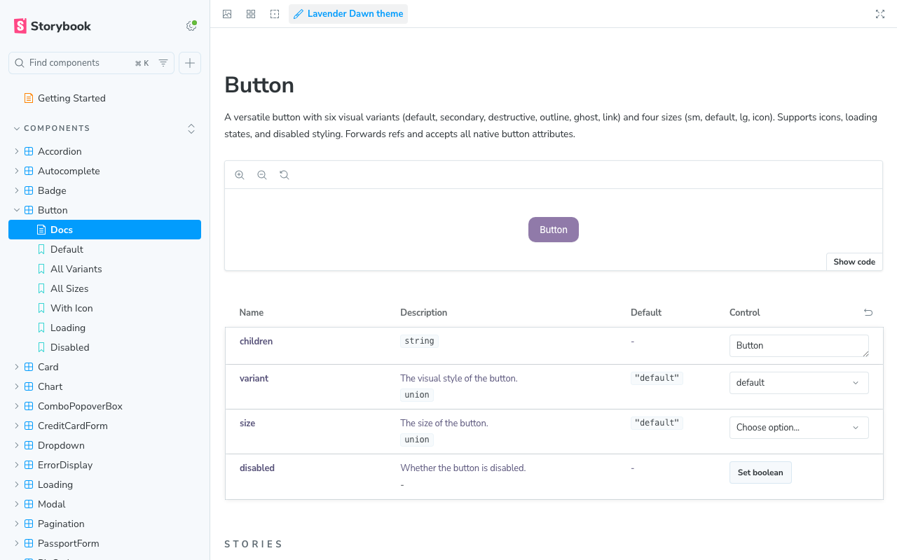
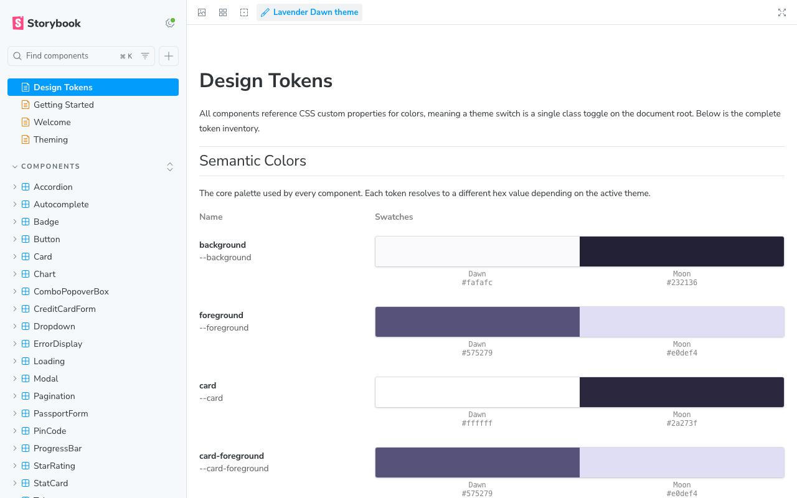
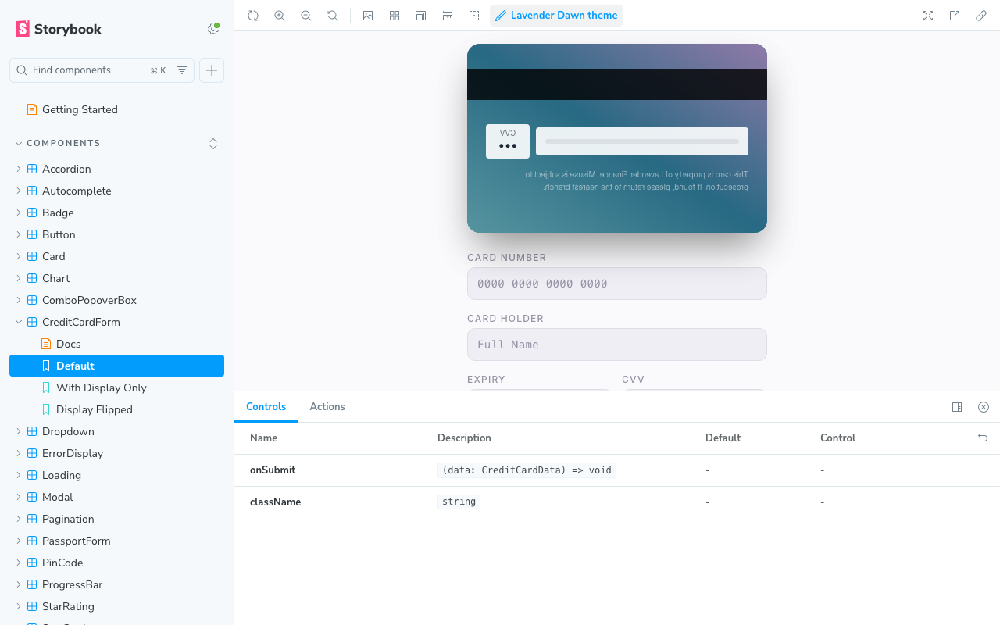

# Lavender Storybook

A themed, copy-paste React component library documented with Storybook. Built as the design system for [Lavender Finance](https://github.com/ShrutiVellanki/lavender-finance).

## Screenshots

### Component Stories

<p>
  
</p>

### Design Tokens

<p>
  
</p>

### Interactive Components

<p>
  
</p>

## Purpose

Lavender Storybook is the single source of truth for every UI component used in [Lavender Finance](https://github.com/ShrutiVellanki/lavender-finance). It is a **copy-paste** library — components are copied directly into consuming projects rather than installed as a package.

Use this repo to:

- Browse and interact with every component in isolation
- Reference prop APIs, variants, and accessibility behaviour
- Copy components into your own project with the Lavender theme

## Tech Stack

| Tool | Role |
|---|---|
| **React 18** | Component runtime |
| **TypeScript** | Static typing |
| **Storybook 8** | Component documentation and visual testing |
| **Tailwind CSS v4** | Utility-first styling via CSS custom properties |
| **Recharts** | Chart primitives (bar, line, area) |
| **Lucide React** | Icon library |
| **clsx + tailwind-merge** | Classname composition (`cn()` helper) |

## Getting Started

### Prerequisites

- Node.js 18+
- npm

### Install and Run

```bash
npm install
npm run storybook
```

Storybook starts at [http://localhost:6006](http://localhost:6006).

### Build for Production

```bash
npm run build-storybook
```

Output is written to `storybook-static/`.

### Lint

```bash
npm run lint
```

## Project Structure

```
src/
├── components/
│   └── ui/                     # All UI components (directory-per-component)
│       ├── Accordion/
│       │   ├── Accordion.tsx
│       │   ├── Accordion.types.ts
│       │   └── index.ts
│       ├── Button/
│       ├── Card/
│       ├── Chart/
│       ├── Combobox/
│       ├── CreditCardForm/
│       ├── Dropdown/
│       ├── ...
│       └── VirtualizedList/
├── lib/
│   └── utils.ts                # cn() helper (clsx + tailwind-merge)
└── index.css                   # Tailwind base + Lavender theme tokens
stories/
├── accordion.stories.tsx       # One story file per component
├── button.stories.tsx
├── ...
├── DesignTokens.mdx            # Design token reference page
├── Introduction.mdx            # Library overview (hidden from sidebar)
├── GettingStarted.mdx          # Onboarding guide (hidden from sidebar)
└── Theming.mdx                 # Theming deep-dive (hidden from sidebar)
.storybook/
├── main.js                     # Storybook config and story globs
└── preview.ts                  # Global decorators, theme setup
```

## Components

| Component | Description |
|---|---|
| Accordion | Collapsible content sections with keyboard navigation |
| Autocomplete | Type-ahead search with async suggestions and blur-clear |
| Badge | Status and category labels with icon support |
| Button | Primary, outline, ghost, link, and danger variants |
| Card | Container with header, title, and content slots |
| Chart | Composable chart container, tooltip, and legend |
| Combobox | Searchable select with custom `renderOption` / `renderValue` |
| CreditCardForm | Multi-field card input with live preview and flip animation |
| Dropdown / Select | Custom listbox with `renderOption`, `renderValue`, `hideLabel` |
| ErrorDisplay | Error state with retry action |
| LanguageSwitcher | Toggle between supported locales |
| Loading | Spinner with optional message |
| Modal | Dialog overlay with focus trapping and keyboard dismiss |
| Pagination | Page navigation with previous / next and page numbers |
| PassportForm | Identity verification form with country-specific validation |
| PinCode | Numeric PIN input with individual digit fields |
| ProgressBar | Horizontal bar with label, auto-variant coloring |
| Sidebar | Collapsible navigation with brand, items, footer, and tooltips |
| StarRating | Interactive star rating input |
| StatCard | KPI card with label, value, icon, trend, and description |
| Tabs | Accessible tabbed interface with keyboard arrow navigation |
| ThemeProvider | Context provider for light / dark theme state |
| ThemeSwitcher | Toggle button between Lavender Dawn and Lavender Moon |
| Tooltip | Hover / focus tooltip with configurable placement |
| TransactionList | Formatted transaction row display |
| VirtualizedList | Windowed rendering for large lists |

## Theming

All components ship with two themes:

- **Lavender Dawn** — light mode
- **Lavender Moon** — dark mode

Theme tokens are defined as CSS custom properties in `src/index.css`. Colors, spacing, typography, and border radii are documented on the **Design Tokens** page inside Storybook.

## How to Add a New Component

1. **Create the component folder**

```
src/components/ui/MyComponent/
├── MyComponent.tsx
├── MyComponent.types.ts
└── index.ts
```

2. **Implement the component** in `MyComponent.tsx` using the Lavender theme tokens and the `cn()` utility for classnames.

3. **Define the prop types** in `MyComponent.types.ts`.

4. **Add a barrel export** in `index.ts`:

```ts
export { MyComponent } from "./MyComponent";
export type { MyComponentProps } from "./MyComponent.types";
```

5. **Write a story** at `stories/my-component.stories.tsx`:

```tsx
import type { Meta, StoryObj } from "@storybook/react";
import { MyComponent } from "../src/components/ui/MyComponent";

const meta: Meta<typeof MyComponent> = {
  title: "Components/MyComponent",
  component: MyComponent,
};

export default meta;
type Story = StoryObj<typeof MyComponent>;

export const Default: Story = {
  args: { /* default props */ },
};
```

6. **Verify** — run `npm run storybook` and confirm the story renders in both Dawn and Moon themes.

## Usage (Copy-Paste)

To use a component in another project:

1. Copy the component directory (e.g. `src/components/ui/Button/`) into your project
2. Copy the Lavender theme tokens from `src/index.css` into your global stylesheet
3. Ensure `clsx` and `tailwind-merge` are installed (used by `cn()`)
4. Import and use — no package installation required

## Related

- [Lavender Finance](https://github.com/ShrutiVellanki/lavender-finance) — the personal finance dashboard that consumes this library

## Future Improvements

- NPM package publishing
- Additional component variants
- Figma token sync
- Automated visual regression testing
